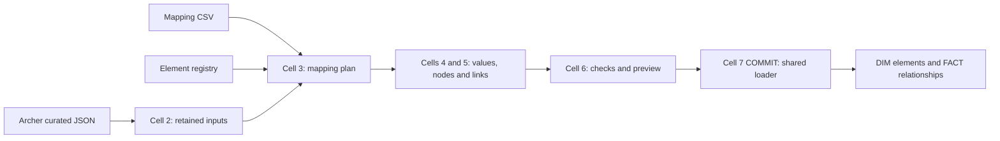

# Archer to OSCAL: project walkthrough and evidence index

Snapshot: September 14, 2026. This is the entry point for explaining the project
to end users, maintainers and reviewers. The source-code links in the detailed
walkthroughs are pinned to the version reviewed here. Later changes belong in
the dated current status and decision log; they must not silently rewrite an
older accepted run.

## What the project does

The notebook reads Archer records, applies approved field mappings, builds a
model-specific hierarchy, and stores elements in DIM tables and parent-child
relationships in FACT tables. The CSV decides what each source field means;
the registry supplies the allowed hierarchy and instance identity. Seven shared
cells execute that metadata for SSP, Assessment Results, POAM and Assessment Plan.

These are approved partial warehouse graphs. A successful graph load does not
mean that every field in an OSCAL model is present or that a complete exported
document passes the official OSCAL schema.

Cell Seven orchestrates the earlier functions; this diagram shows the logical
data flow, not additional notebook cells.

## Where to find each explanation

| Need | Maintained reference |
| --- | --- |
| Explain configuration, source reads, mapping compilation and transformations | [Cells One through Four](CELLS_1_TO_4_EXPLAINED.md) |
| Explain graph construction, validation, storage and run outcomes | [Cells Five through Seven](CELLS_5_TO_7_EXPLAINED.md) |
| Explain every CSV row, its chosen path, transform and status | [Current field index](MAPPING_FIELD_INDEX.md), backed by the [executable CSV](../Mapping/ARCHER_OSCAL_MAPPINGS.csv) |
| Resume the work with current evidence and next step | [Project handoff](PROJECT_HANDOFF.md) and [current status](CURRENT_STATUS.md) |
| Explain why decisions changed | [Decision log](DECISION_LOG.md) and the historical checkpoint links below |
| Explain shared configuration and boundaries | [Architecture context](ARCHITECTURE_CONTEXT.md) |
| Find test scope and commands | [Test instructions](../tests/lean/README.md) and the CI checkpoint below |

The source walkthroughs explain each function and configuration/execution block
in source order with exact line references. They do not duplicate all source
lines into a second implementation. Blank lines and comments belong to their
surrounding block. Follow the pinned source when explaining a specific statement.

## How we got here

| Milestone | What was established or changed | Evidence |
| --- | --- | --- |
| Initial supplied notebook | The recorded supplied version was 860 total lines, 669 excluding blank/comment-only lines. The expanded draft reached 4,262 total lines. The owner asked for understandable, purposeful code rather than a fixed line cap. | [Measured comparison](checkpoints/2026-09-12-notebook-bulk-reduction.md) |
| SSP metadata and system characteristics | Built and checked field conversions, collection identities and hierarchy. Early counts are historical checkpoints, not current load totals. | [September 9 characteristics run](checkpoints/2026-09-09-ssp-system-characteristics-contract-run.md), [registry snapshot](checkpoints/2026-09-09-oscal-element-registry-collection-snapshot.md) |
| SSP system implementation | Six reference mappings identify components. Reviewed software/interconnection lookups add available details; hydration is partial. | [Component source contract](checkpoints/2026-09-09-ssp-component-source-contract.md), [hydration run](checkpoints/2026-09-10_ssp_component_hydration_run.md) |
| SSP graph assembly and first full DEV reload | Mapped-scope assembly and then DEV persistence were recorded separately. The accepted full reload contained 2,813 records, 70,102 elements and 67,289 relationships. | [Assembly](checkpoints/2026-09-10_ssp_mapped_scope_assembly_accepted.md), [full reload](SSP_FULL_DEV_RELOAD_2026-09-11.md) |
| Seven-cell simplification | Removed duplicate execution formats and redundant machinery while retaining the shared graph and write checks. The current seven cells total 1,903 lines, including later model additions. | [Lean rebuild](checkpoints/2026-09-13-lean-rebuild.md), [architecture](ARCHITECTURE_CONTEXT.md) |
| SSP live value reconciliation | Investigated the preview's impact/sensitivity differences. Restored direct sensitivity mapping and corrected lookup casing; the later unchanged preview and commit supersede the earlier proposed updates. | [Value review](checkpoints/2026-09-13-ssp-read-only-value-reconciliation.md), [corrected preview](checkpoints/2026-09-13-ssp-preview-no-target-changes.md), [commit/readback](checkpoints/2026-09-13-ssp-commit-completed-and-verified.md) |
| Assessment Results | Expanded to 32 approved observation mappings. Cleaned ambiguous visible paths, preserved explicit nulls, and corrected two exact source keys with leading underscores. These were separate changes, not evidence of 32 populated fields in every record. | [AR guide and history](AR_NEXT_RUN.md), [accepted AR commit](checkpoints/2026-09-13-assessment-results-commit-completed-and-verified.md) |
| POAM | Enabled the same-source POAMS references with root/item registry metadata and model-specific tables. The posted preview contains 2,821 nodes and eight relationships; a committed result has not been established by that preview. | [POAM guide](POAM_NEXT_RUN.md) |
| Assessment Plan | Enabled request, approval and review comments, plus two task support mappings. Published table and registry setup. The first registry setup exposed a required-column error; root identity was corrected to SINGLETON without changing graph identity. | [SAP guide, setup and regression evidence](SAP_NEXT_RUN.md) |
| SSP daily loss | Enabled the previously deferred field through CSV direct mapping and existing null preservation. No runtime change. A first live result for that added field is still pending. | [Daily-loss decision and guide](SSP_DAILY_LOSS_NEXT_RUN.md) |

Original workbook notes stay as provenance where later owner decisions override
them. A historical instruction saying a field is deferred is not the current
execution status when its later approved CSV row explicitly supersedes it.

## Current model coverage and live evidence

The CSV has **153 rows: 86 approved, one populated-value guard, 64 deferred and
two excluded**. The following are selected mapping-row counts, not distinct
source fields, output columns or element types.

| Model | Selected rows now | What is enabled | Live position |
| --- | ---: | --- | --- |
| SSP | 49: 48 approved plus one guard | Accepted metadata, characteristics and six component-reference mappings; daily loss was added afterward. Three labelled support rules include two CONFIG values and one source-field rule. | Earlier mapped subset committed and read back: 70,102 DIM / 67,289 FACT across 2,813 records. That acceptance does not include the new daily-loss mapping. |
| Assessment Results | 32 | Supported populated values or explicit null produce observations with named properties; absent keys and empty text/containers are omitted. | The earlier AR30-stage commit/readback accepted 73,189 DIM / 70,376 FACT. Owner later confirmed the underscore correction resolved; no separate current AR32 committed report is inferred. Neither fact proves all 32 are populated in every record. |
| POAM | 1 | POAMS references produce package-scoped item identities under the POAM root. | Accepted preview proposes 2,821 DIM and eight FACT inserts, zero updates, no target writes. Committed readback remains unverified. |
| Assessment Plan | 5: three source plus two CONFIG | Request/approval become task property child nodes; comments become task remarks. | Registry root correction and matching DDL delivered. Owner acknowledged the DDL step; a full successful SAP preview/load report is not yet recorded. |

SSP Control Implementation's **42 mapping rows remain deferred**. It is a
different SSP section from the six enabled System Implementation references.
The new walkthrough does not approve or implement additional mappings.

## Follow one field from source to stored rows

1. Identify the exact source key and source binding in the CSV. Leading
   underscores matter; a similarly named percentage field is a different field.
2. Read the approved target path, transform, value source and null policy.
   Prose alternatives such as "observations or props" are not executable paths.
3. The registry gives the owner element, parent, collection operator and
   instance identity. A mapping may target a JSON member inside that element.
4. Cell Four obtains the value, resolves any configured lookup and creates the
   payload. An absent key and an explicit JSON null are different conditions.
5. Cell Five assigns the node key/UUID and links the instance to its parent.
6. Cell Six checks that graph, converts its columns to the target layout,
   calculates actual inserts/updates/unchanged rows, then optionally merges.
7. The run report and readback evidence show what happened to that batch.

For AR, the stored element types can be root, results and observations even
though there are 32 mappings. The property name is inside observation JSON.
For SAP, properties are separately stored child elements and comments are
inline remarks in the task. Looking only at distinct element types cannot
measure mapped-field coverage.

## Primary keys, UUIDs and parent links

Each separately stored DIM element has its own key. The usual deterministic
key inputs are identity version, source system/table, source record, model,
element path and instance key. The current mapper uses MD5 for the 32-hex
warehouse key and UUIDv5 for most UUIDs; linked party identities have their
own registry-governed path. These identifiers are not security checksums.

FACT stores the parent's hash in FK_SOURCE_ELEMENT_HASH and the child's hash
in FK_TARGET_ELEMENT_HASH, plus their UUIDs. The edge key also includes the
relationship type. Following those links establishes ownership and siblings.
Children do not reuse the parent's primary key as their own.

The warehouse UUID exists even when the OSCAL JSON payload does not allow a
uuid member. The registry decides whether a payload includes one. During
storage, hash strings become BINARY(16), UUIDs lose hyphens to fit VARCHAR(32),
and payload JSON becomes VARIANT. DIM has ten columns and FACT has six.

Identity policy matters for changes. AR observations and SAP properties use
source-field identity, so an ordinary value change can update the same node.
Existing SSP properties include their value in identity: a later value change
can create a different candidate key and trigger the loader's obsolete-row
block. The daily-loss release retains that behavior; it does not add automatic
deletion or change the shared SSP registry rule.

## What a successful test or run means

| Evidence | Establishes | Does not establish |
| --- | --- | --- |
| Local synthetic regressions | Specific conversion, identity, graph and loader cases | Actual production source coverage |
| Private readable screenshot excerpts | Exact reviewed examples work, with synthetic context where stated | Execution of an entire reconstructed source dataset |
| Installed Snowpark tests and local SQL adapter | Runtime API compatibility and simulated persistence scenarios | Live Snowflake scripting, MERGE or transaction acceptance |
| Live PREVIEW with storage checks | Candidate graph, destination compatibility and proposed changes for that snapshot | A committed write |
| Live COMMITTED_AND_VERIFIED report | The batch committed and its readback matched | Every model field is implemented or full OSCAL export is conformant |

Latest implementation validation for this snapshot:
[237 tests passed, zero skips](https://github.com/theenduser009/Oscal-mapping-strategy/actions/runs/34855613652).
The setup regression first reproduced the actual NOT NULL failure, then checked
the corrected source rows against that constraint and verified unchanged graph
identity. Private screenshots and transcribed source examples are not in this
public documentation or repository.

PREVIEW may create temporary staging/baseline tables, but does not write target
DIM/FACT rows. COMMIT previews all selected routes first, then commits each route
separately. A later model failure does not roll back an earlier model's successful
transaction. Audit-only differences do not cause an ordinary update. "Unchanged"
means the candidate matched stored business values for those keys, not that a
mapping was skipped or the whole model is complete.

## How future work stays explainable

For every mapping or code change, keep the source/model/path, reason, changed
files, identity/null behavior, test evidence, live evidence and next action in
the current checkpoint. Link the commit and retain superseded decisions with
dates. Update the field index if the CSV changes and update the walkthrough's
line references when runtime code changes. Keep source pages generated from the
same seven maintained files; do not maintain a second executable notebook by hand.

An approved field using supported behavior generally needs CSV metadata only.
A new hierarchy needs registry rows; a new model needs routing/storage settings
and its target tables. A truly new transformation needs one reusable handler,
with its reason and tests documented. A null by itself is not a reason to defer
an owner-approved field; the explicit null policy controls its output.
